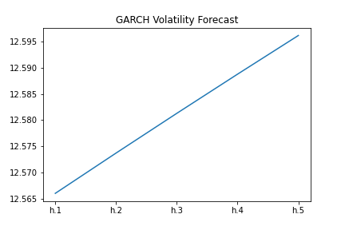

# Time Series CAD/JPN Exchange Rate Analysis

## Background

In this assignment, I will use the many time series tools that I have learned in order to predict future movements in the value of the Canadian dollar versus the Japanese yen.

I will Analyse CAD/JPY using:

1. Time series forecasting
2. Linear regression modelling

- - -

### Files

[Time-Series Starter Notebook](Code/time_series_analysis.ipynb)

[Linear Regression Starter Notebook](Code/regression_analysis.ipynb)

[CAD/JPY Data CSV File](Code/cad_jpy.csv)

- - -

# Time-Series Forecasting

## Plotting the Settle price to check for long or short-term patterns.
   

**Do you see any patterns, long-term and/or short?**
* Based on the plot above we can see a long-term weakening of the Canadian Dollar respective to the Japanese Yen. We note a large decline in the CAD/JPY exchange rate from 1990 to 1996, reaching a maximum of 1 CAD = 137.28 JPY and falling to a minimum of 1 CAD = 58.88 JPY.
* From 1996 we see the exchange rate rise to 1 CAD = 118.65 JPY in 2007 and rapidly fall during the GFC due to the period of enhanced volatiltiy.
* From 2008 we can note the CAD/JPY has remained relatively consistent, remaining around 1 CAD = 80 to 100 JPY.

## Decomposition using a Hodrick-Prescott filter (decompose the settle price into trend and noise).
    

Price Trend             |  Settle Noise
:-------------------------:|:-------------------------:
   |  

**Do you see any patterns, long-term and/or short?**
* By smoothing with the HP Filter and plotting the trend against the actual exchange rate price data, we can see that there are short-term fluctuations that deviate around this trend. When the blue line (Price Data) deviates below the orange (Trend Line) we can see this as a sign that the YEN is undervalued and therefore an opportunity to purchase the Japanese YEN with Canadian Dollars
* During this period we can note a long-term pattern of the decline of the CAD/JPY exchange rate from 1 CAD = 103.12 JPY in 2015 to 1 CAD = 74.69 JPY in 2020.
* We can note short-term patterns of a rapid decrease of the CAD/JPY exchange rate from mid 2015 to late 2016. From 2017 to the start of 2020 the exchange rate remained consistent, averaging 1 CAD = 84.36 JPY. 
* From the start of 2020 to the last data point avaliable we can note a rapid decline in the exchange rate as a result of the COVID-19 pandemic.

## Forecasting returns using an ARMA model.
    
ARMA Model Results             |  5 Day Returns Forecast
:-------------------------:|:-------------------------:
   |  

**Based on the p-value, is the model a good fit?**
* Based on the p-value of the ARMA model, we can see that the model is overall not a good fit. The p-value for the first AR and MA (both Lag 1) component are less than 0.05 making it statistically significant, indicating we can reject the null hypothesis for ar.L1 and ma.L1. However the p-value for ar.L2 is above 0.05, therefore making it statisticallt insignificant. Therefore we cannot reject the null hypothesis.

## Forecasting the exchange rate price using an ARIMA model.

ARIMA Results             |  5 Day Returns Price Forecast
:-------------------------:|:-------------------------:
   |  

**What does the model forecast will happen to the Japanese Yen in the near term?**
* This model forecasts that over the next 5 days the CAD/JPY Exchange rate will have an overall negative trend movement. Meaning 1 Canadian Dollar will equate to less Japanese Yen, indicating the strengthening of JPY relative to the CAD.

## Forecasting volatility with GARCH.

**Note:** Our p-values for GARCH and volatility forecasts tend to be much lower than our ARMA/ARIMA return and price forecasts. In particular, here we have all p-values of less than 0.05, except for alpha(2), indicating overall a much better model performance. In practice, in financial markets, it's easier to forecast volatility than it is to forecast returns or prices. (After all, if we could very easily predict returns, we'd all be rich!)

**What does the model forecast will happen to volatility in the near term?**
* Based on the plot above, the forecast for CAD/JPY volatility is expected to rise in the near term

Use the results of the completed time series analysis and modelling to answer the following questions:

## Conclusions
1. Based on your time series analysis, would you buy the yen now?
    * Based on this analysis, the YEN will get stronger, so it's a good investment oportunity. 

2. Is the risk of the yen expected to increase or decrease?
    * It is expected that the risk (volatility) will increase, so others factors should be addressed before investment

3. Based on the model evaluation, would you feel confident in using these models for trading?
    * I am not confident in using these models for trading as the models are not a good fit. This is determined by the p-value being greater than 0.05. Therefore the models are statistically insignificant and we cannot reject the null hypothesis 
    * Before trading the CAD/JPY we should always take into account the current economic and political conditions Canadia and Japan.

# Linear Regression Forecasting

In this notebook, I have built a Scikit-Learn linear regression model to predict CAD/JPY returns with *lagged* CAD/JPY futures returns and categorical calendar seasonal effects (e.g., day-of-week or week-of-year seasonal effects).

* Does this model perform better or worse on out-of-sample data compared to in-sample data?

**Answer**
* To evaluate the performance of the out-of-sample vs in-sample data, we will use the Root Mean Squared Error (RMSE) as a metric. The RSME is the standard deviation of the residuals (prediction errors). Residuals are a measure of how far from the regression line the data points are. RSME therefore measures how spread out these residuals are. Allowing us to evaluate how concentrated the data is around the line of best fit.

**Results:**
* Out-of-Sample Root Mean Squared Error (RMSE): 0.6445805658569028
    * Out-of-Sample data is data that the model hasn't seen before (testing data).
* In-sample Root Mean Squared Error (RMSE): 0.841994632894117
    * In-sample data is data that the model was trained on (training data).
* The out-of-sample RMSE is lower than the in-sample RMSE. RMSE is typically lower for training data, but is higher in this case.
* These results indicate that the out-of-sample data is more concentrated around the line of best fit compared to the in-sample data and hence, performed better.